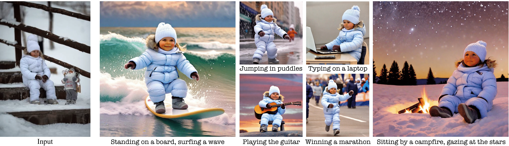

<div align="center">

<h1>Visual Persona: Foundation Model for Full-Body Human Customization</h1>

<p>
  <a href="https://scholar.google.com/citations?user=xakYe8MAAAAJ"><strong>Jisu Nam</strong></a><sup>1</sup> ·
  <a href="https://scholar.google.com/citations?user=Eo87mRsAAAAJ"><strong>Soowon Son</strong></a><sup>1</sup> ·
  <a href="https://scholar.google.com/citations?user=pF2vMhgAAAAJ"><strong>Zhan Xu</strong></a><sup>2</sup> ·
  <a href="https://scholar.google.com/citations?&user=GPDTa9sAAAAJ"><strong>Jing Shi</strong></a><sup>2</sup> ·
  <a href="https://scholar.google.com/citations?&user=FHtM5MUAAAAA"><strong>Difan Liu</strong></a><sup>2</sup> ·
  <a href="https://scholar.google.com/citations?&user=uiqXutMAAAAJ"><strong>Feng Liu</strong></a><sup>2</sup> ·
  <a href="https://scholar.google.com/citations?&user=WEVBTxsAAAAJ"><strong>Aashish Misra</strong></a><sup>3</sup> ·
  <a href="https://scholar.google.com/citations?&user=cIK1hS8AAAAJ"><strong>Seungryong Kim</strong></a><sup>1</sup> ·
  <a href="https://scholar.google.com/citations?&user=UuwugFEAAAAJ"><strong>Yang Zhou</strong></a><sup>2</sup>
</p>

<p>
  <sup>1</sup>KAIST AI &emsp;
  <sup>2</sup>Adobe Research &emsp;
  <sup>3</sup>Adobe
</p>

<p>
  <strong>CVPR 2025</strong>
</p>

<p>
  <a href="https://arxiv.org/abs/2503.15406"></a>
  <a href="https://cvlab-kaist.github.io/Visual-Persona/"></a>
</p>

<p float="center">
  
</p>

**Visual Persona** is a foundation model for **🏄 Full-Body Human Customization**. Given a reference image of a person, our model generates diverse, customized images while faithfully preserving the full-body appearance — including face, clothing, body shape, and accessories.

</div>

## ✨ Highlights

- **Full-body fidelity**: Preserves identity across face, torso, legs, and shoes simultaneously
- **Versatile applications**: A single model supports multiple downstream tasks via plug-in adapters
- **Flexible control**: Supports both pose-guided and text-guided generation

## 🚀 Applications

| Task | Description |
|---|---|
| **Pose-Guided Human Customization** | Generate the reference person in arbitrary poses |
| **Story Generation** | Create consistent multi-scene narratives with the same identity |
| **Text-Guided Virtual Try-On** | Change clothing while preserving the person's appearance |
| **Anime Character Customization** | Transfer identity to stylized, non-photorealistic characters |


## 🛠️ Installation

We recommend using a conda environment with Python 3.10.

```bash
conda create -n visual_persona python=3.10 -y
conda activate visual_persona
pip install -r requirements.txt
```


## 📦 Pretrained Models

**Step 1.** Download the DINOv2 ViT-G/14 backbone:

```bash
mkdir pretrained_models
cd pretrained_models
wget https://dl.fbaipublicfiles.com/dinov2/dinov2_vitg14/dinov2_vitg14_pretrain.pth
```

**Step 2.** Download our Visual Persona checkpoints from [Google Drive](https://drive.google.com/drive/folders/1NIYbLrKL05nEbStpq4LEhVjcjFwpUWkG) into `./pretrained_models/`.

After both steps, the directory should look like:

```
pretrained_models/
├── dinov2_vitg14_pretrain.pth
├── diffusion_pytorch_model.safetensors
└── wieght.bin
```


## 🏃 Inference

Run the script corresponding to your desired application:

```bash
# Base pose-guided generation
python inference.py

# Pose-guided generation with ControlNet
python inference_controlnet.py

# Multi-scene story generation
python inference_controlnet_story.py

# Text-guided virtual try-on
python inference_tryon.py

# Anime / character customization
python inference_anime.py
```

> **Tip:** Each script contains configurable arguments at the top of the file (input image path, prompt, output directory, etc.).


## Testing Dataset Preparation

We use [SCHP (Self-Correction Human Parsing)](https://github.com/GoGoDuck912/Self-Correction-Human-Parsing) to parse input images into five body regions: **full-body, face, torso, legs,** and **shoes**. Any other state-of-the-art human parsing method can be substituted.

**Download the SCHP ATR checkpoint** into `./pretrained_models/`:
- [SCHP ATR checkpoint (Google Drive)](https://drive.google.com/file/d/1ruJg4lqR_jgQPj-9K0PP-L2vJERYOxLP/view)

Then run:

```bash
# Parse a single image
python parsing.py --input_path /path/to/image.jpg

# Parse all images in a directory
python parsing.py --input_path /path/to/images/ --output_dir ./parsing
```

## 📚 Citation

If you find this work useful, please consider citing:

```bibtex
@inproceedings{nam2025visual,
  title     = {Visual Persona: Foundation Model for Full-Body Human Customization},
  author    = {Nam, Jisu and Son, Soowon and Xu, Zhan and Shi, Jing and Liu, Difan and Liu, Feng and Misra, Aashish and Kim, Seungryong and Zhou, Yang},
  booktitle = {Proceedings of the IEEE/CVF Conference on Computer Vision and Pattern Recognition (CVPR)},
  pages     = {18630--18641},
  year      = {2025}
}
```

## 🙏 Acknowledgements

This project builds on [IP-Adapter](https://github.com/tencent-ailab/IP-Adapter). We thank the authors for their excellent work.